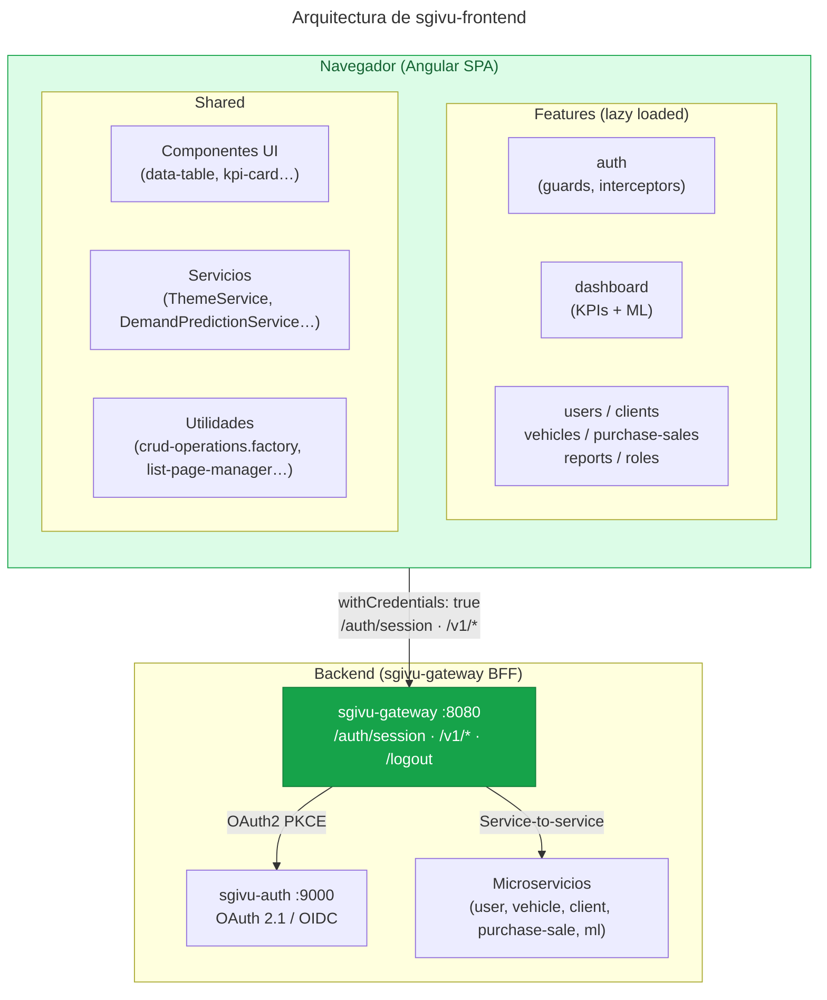

# Arquitectura

sgivu-frontend sigue las mejores prácticas modernas de Angular: arquitectura por features, estado reactivo con signals, detección de cambios zoneless y comunicación con el backend a través del patrón BFF.

## Diagrama de Capas



## Principios Arquitectónicos

### Standalone Components (sin NgModules)

Todos los componentes son standalone — declaran sus dependencias en `imports: [...]` directamente:

```typescript
@Component({
  selector: "app-vehicle-list",
  standalone: true,
  changeDetection: ChangeDetectionStrategy.OnPush,
  imports: [DataTableComponent, PagerComponent, RouterLink],
  templateUrl: "./vehicle-list.component.html",
})
export class VehicleListComponent {}
```

### Zoneless + Signals

La detección de cambios no depende de Zone.js. `provideZonelessChangeDetection()` en `app.config.ts` — junto con `OnPush` en todos los componentes — significa que Angular solo re-renderiza cuando un signal cambia. Ver [Zoneless y Signals](/architecture/zoneless-signals) para el detalle.

### Lazy Loading por Feature

El router raíz (`app.routes.ts`) carga cada feature bajo demanda:

```typescript
{
  path: 'vehicles',
  canActivate: [authGuard, permissionGuard],
  loadChildren: () =>
    import('./features/vehicles/vehicle.routes').then(m => m.vehicleRoutes),
  data: {
    canActivateFn: (ps: PermissionService) => ps.hasPermission('vehicle:read'),
  },
},
```

Esto genera chunks separados por feature que el navegador descarga solo cuando se navega a esa ruta.

### BFF (Backend For Frontend)

El frontend nunca habla con microservicios individuales. Toda la comunicación va a `sgivu-gateway`, incluyendo el flujo OAuth 2.1/PKCE. Ver [Autenticación BFF](/architecture/authentication).

## Organización del Código

```
src/app/
├── app.component.ts          # Componente raíz con layout y banner de servicios caídos
├── app.config.ts             # ApplicationConfig: providers, interceptors, locale
├── app.routes.ts             # Rutas raíz con lazy loading
├── features/
│   ├── auth/                 # OAuth, guards, interceptor, servicios de sesión
│   ├── dashboard/            # KPIs, gráficos, panel ML
│   ├── users/                # CRUD usuarios y perfil
│   ├── clients/              # Personas y empresas
│   ├── vehicles/             # Autos y motos, imágenes S3
│   ├── purchase-sales/       # Contratos compraventa
│   ├── reports/              # Reportes analíticos (4 pestañas)
│   └── roles/                # Gestión de roles y permisos
└── shared/
    ├── components/           # Componentes UI reutilizables
    ├── services/             # Servicios compartidos
    ├── directives/           # *appHasPermission, row-navigate
    ├── pipes/                # COPCurrencyPipe, UtcToGmtMinus5Pipe
    ├── validators/           # Validators y presets de formularios
    ├── models/               # Interfaces compartidas
    └── utils/                # Factories y helpers
```

**Regla shared vs feature**: un artefacto va a `shared/` solo si lo usan ≥ 2 features o es genuinamente genérico sin conocimiento de dominio. Todo lo que pertenece a un único dominio vive dentro de su feature, aunque hoy lo use solo esa feature.

## Configuración Central (`app.config.ts`)

```typescript
export const appConfig: ApplicationConfig = {
  providers: [
    provideZonelessChangeDetection(),
    provideRouter(routes),
    provideHttpClient(
      withInterceptors([defaultOAuthInterceptor, serviceHealthInterceptor]),
    ),
    provideCharts({ registerables: [LineController, BarController /* … */] }),
    { provide: LOCALE_ID, useValue: "es-CO" },
    provideAppInitializer(() => inject(ThemeService).initialize()),
    provideAppInitializer(() => inject(AuthService).initializeAuthentication()),
  ],
};
```

<Note>
  Chart.js usa tree-shaking manual: solo se registran los controladores y
  escalas realmente usados (no `withDefaultRegisterables()`) para mantener el
  bundle dentro de los presupuestos de producción.
</Note>

## Profundizar

<CardGroup cols={2}>
  <Card
    title="Zoneless y Signals"
    icon="bolt"
    href="/architecture/zoneless-signals"
  >
    Cómo funciona la reactividad sin Zone.js
  </Card>
  <Card
    title="Autenticación BFF"
    icon="shield-check"
    href="/architecture/authentication"
  >
    Flujo OAuth 2.1 delegado al gateway
  </Card>
  <Card
    title="Autorización RBAC"
    icon="lock"
    href="/architecture/authorization"
  >
    Guards, directivas y permisos granulares
  </Card>
  <Card
    title="Gestión de Estado"
    icon="database"
    href="/architecture/state-management"
  >
    Servicios con signals y factories CRUD
  </Card>
</CardGroup>
