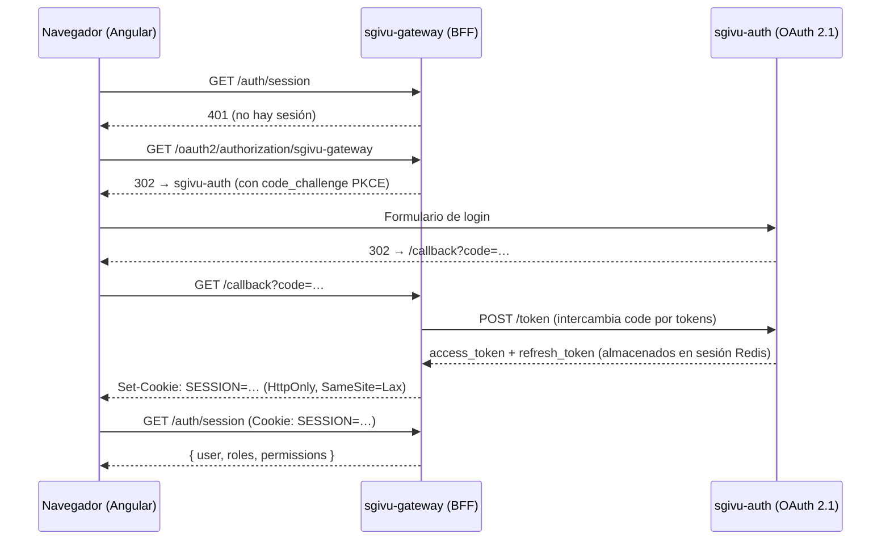

# Autenticación BFF

sgivu-frontend implementa **BFF puro** (Backend For Frontend): no hay ninguna librería OAuth en el cliente. El flujo OAuth 2.1/PKCE vive completamente en `sgivu-gateway`, que emite una cookie de sesión al navegador. El frontend solo consulta un endpoint para saber si hay sesión activa.

## Flujo Completo



El navegador nunca ve los tokens JWT — la cookie HttpOnly es la única credencial que maneja.

## `AuthService`

**Ruta**: `src/app/features/auth/services/auth.service.ts`

Estado expuesto como signals de solo lectura:

```typescript
// Signals públicos (readonly)
readonly isAuthenticated: Signal<boolean>
readonly isDoneLoading: Signal<boolean>      // APP_INITIALIZER completó
readonly currentAuthenticatedUser: Signal<User | null>
readonly userId: Signal<string | undefined>
readonly username: Signal<string | undefined>
readonly isAdmin: Signal<boolean>            // computed
readonly rolesAndPermissions: Signal<Set<string>>
readonly isReadyAndAuthenticated: Signal<boolean> // computed: isDone && isAuth
```

### Inicialización

Al arrancar la app, `provideAppInitializer(() => inject(AuthService).initializeAuthentication())` en `app.config.ts` consulta `/auth/session` antes de renderizar la primera ruta. Si hay sesión activa, puebla los signals; si no, deja `isAuthenticated` en `false`.

### Keep-Alive de Sesión

Para mantener el TTL deslizante de la sesión en Redis (lado gateway), el servicio hace un ping a `/auth/session` cada 20 minutos mientras la pestaña está visible:

```typescript
private static readonly SESSION_KEEPALIVE_INTERVAL_MS = 20 * 60 * 1000;

// Se pausa automáticamente cuando el usuario cambia de pestaña
// (usando el Page Visibility API) para no consumir recursos innecesariamente
```

## `defaultOAuthInterceptor`

**Ruta**: `src/app/features/auth/interceptors/default-oauth.interceptor.ts`

Interceptor funcional (`HttpInterceptorFn`) que se aplica a **todas** las peticiones:

```typescript
export const defaultOAuthInterceptor: HttpInterceptorFn = (req, next) => {
  // Agrega withCredentials: true para que el navegador envíe la cookie de sesión
  const authReq = req.clone({ withCredentials: true });

  return next(authReq).pipe(
    catchError((error) => {
      if (error.status === 401) {
        // Redirige al flujo de login (excepto en estas rutas)
        authService.startLoginFlow();
      }
      return throwError(() => error);
    }),
  );
};
```

### Excepciones al manejo de 401

| Ruta                                     | Motivo de la excepción                                              |
| ---------------------------------------- | ------------------------------------------------------------------- |
| `/auth/session`                          | El 401 indica "no hay sesión" — es el mecanismo normal de detección |
| `/logout`                                | Puede devolver 401 si la sesión ya expiró antes del logout          |
| Requests con header `SKIP_HEALTH_HEADER` | Health-checks internos del `ServiceHealthInterceptor`               |

## `authGuard`

**Ruta**: `src/app/features/auth/guards/auth.guard.ts`

```typescript
export const authGuard: CanActivateFn = (route, state) => {
  const authService = inject(AuthService);
  return authService.isDoneLoading$.pipe(
    filter((isDone) => isDone),
    take(1),
    switchMap(() => authService.enforceAuthentication(state.url)),
  );
};
```

**Por qué espera `isDoneLoading`**: El guard no puede evaluar si el usuario está autenticado hasta que el `APP_INITIALIZER` termine de consultar `/auth/session`. Sin este paso, el guard podría redirigir a login aunque el usuario tenga sesión válida (race condition al recargar la app).

## Logout

El logout redirige a `${apiUrl}/logout`, que invalida la sesión en Redis y limpia la cookie. El frontend no necesita limpiar nada localmente porque no tiene tokens.

## Endpoints del Gateway

| Endpoint                                  | Descripción                                     |
| ----------------------------------------- | ----------------------------------------------- |
| `GET /auth/session`                       | Verificar sesión activa (devuelve user + roles) |
| `GET /oauth2/authorization/sgivu-gateway` | Iniciar flujo OAuth (redirect)                  |
| `GET /callback`                           | Callback OAuth (maneja el code exchange)        |
| `GET /logout`                             | Cerrar sesión                                   |
| `GET /v1/*`                               | APIs de negocio (proxeadas a microservicios)    |

## Próximos Pasos

<CardGroup cols={2}>
  <Card
    title="Autorización RBAC"
    icon="lock"
    href="/architecture/authorization"
  >
    Permisos granulares y directiva appHasPermission
  </Card>
  <Card title="Integración Gateway" icon="server" href="/integration/gateway">
    Comunicación HTTP completa con el backend
  </Card>
</CardGroup>
