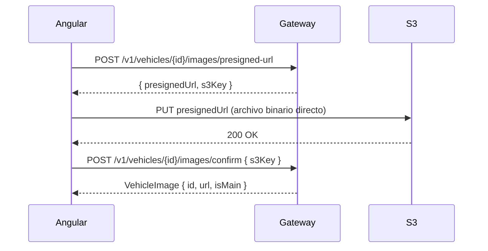

# Inventario de Vehículos

Gestiona el catálogo completo de vehículos del concesionario: **automóviles** y **motocicletas**. Incluye especificaciones detalladas, seguimiento de estado y carga de imágenes a AWS S3 mediante URLs prefirmadas.

**Ubicación**: `src/app/features/vehicles/`  
**Rutas**: `/vehicles/*`

## Permisos Requeridos

| Acción             | Permiso                 |
| ------------------ | ----------------------- |
| Ver inventario     | `vehicle:read`          |
| Crear vehículo     | `vehicle:create`        |
| Editar vehículo    | `vehicle:update`        |
| Eliminar vehículo  | `vehicle:delete`        |
| Gestionar imágenes | `vehicle:manage_images` |

## Estados de Vehículo

| Estado           | Descripción                     |
| ---------------- | ------------------------------- |
| `AVAILABLE`      | Disponible para compra          |
| `RESERVED`       | Reservado por un cliente        |
| `SOLD`           | Vendido (tiene contrato activo) |
| `IN_MAINTENANCE` | En mantenimiento                |
| `IN_REPAIR`      | En reparación                   |
| `INACTIVE`       | Fuera de catálogo               |

## Componentes

### `VehicleListComponent`

**Rutas**: `/vehicles/cars/page/:page`, `/vehicles/motorcycles/page/:page`

Lista paginada con pestañas (Autos / Motos):

- Filtros por estado, rango de precio, año, transmisión (autos), cilindrada (motos)
- Búsqueda por marca, modelo o VIN
- Miniaturas de imagen principal
- KPIs: disponibles, reservados, vendidos

### `VehicleFormComponent`

**Rutas**: `/vehicles/cars/create`, `/vehicles/cars/:id/edit` (y equivalente para motos)

Formulario con:

- Información básica: marca, modelo, año, VIN, color, kilometraje, precio
- Especificaciones según tipo:
  - **Auto**: puertas, asientos, transmisión (`MANUAL`/`AUTOMATIC`), tipo de combustible
  - **Moto**: cilindrada, tipo (`SPORT`/`CRUISER`/`TOURING`/`OFF_ROAD`)
- Gestión de estado

### `VehicleDetailComponent`

**Rutas**: `/vehicles/cars/:id/details`, `/vehicles/motorcycles/:id/details`

Vista completa con especificaciones, galería de imágenes y historial de estados.

### `VehicleImageManagerComponent`

Galería de imágenes con:

- Vista en grid de todas las imágenes del vehículo
- Designar imagen principal
- Subir nuevas imágenes (múltiples a la vez)
- Eliminar imágenes

## Servicios

### `CarService` / `MotorcycleService`

CRUD de autos y motos respectivamente. Endpoints: `GET/POST/PUT/DELETE /v1/cars` y `/v1/motorcycles`.

### `VehicleImageService` y `VehicleImageUploadService`

Gestiona el flujo de carga de imágenes a S3 en tres pasos:



La imagen nunca pasa por el backend — Angular sube directamente a S3 con la URL prefirmada que el gateway genera. Esto reduce la carga en el servidor y mejora la velocidad de carga.

### `VehicleUIHelperService`

Formateo de etiquetas de estado, tipo de transmisión, combustible y tipo de moto para la UI.

## Modelos

```typescript
interface Car extends BaseVehicle {
  doors: number;
  seats: number;
  transmission: "MANUAL" | "AUTOMATIC";
  fuelType: "GASOLINE" | "DIESEL" | "ELECTRIC" | "HYBRID";
}

interface Motorcycle extends BaseVehicle {
  engineDisplacement: number;
  motorcycleType: "SPORT" | "CRUISER" | "TOURING" | "OFF_ROAD";
}

interface VehicleImage {
  id: string;
  url: string;
  isMain: boolean;
}
```

## Próximos Pasos

<CardGroup cols={2}>
  <Card
    title="Contratos de Compraventa"
    icon="handshake"
    href="/features/purchase-sales"
  >
    Asociar vehículos a contratos
  </Card>
  <Card title="Reportes" icon="chart-bar" href="/features/reports">
    Análisis de inventario y rentabilidad
  </Card>
</CardGroup>
