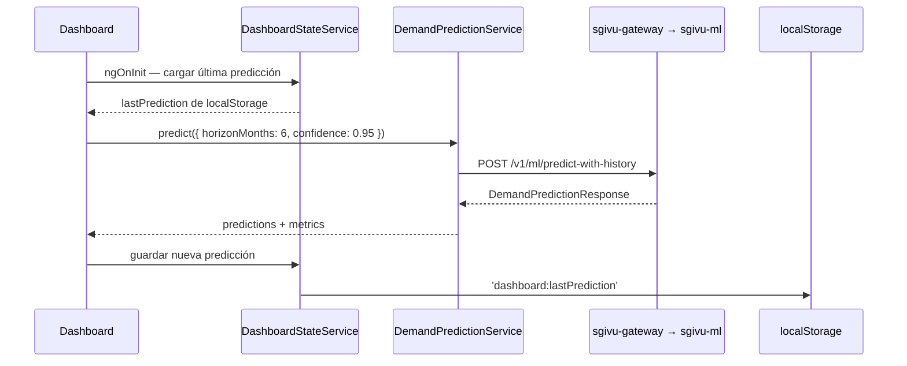

# Predicción de Demanda ML

sgivu-frontend integra el servicio de ML del backend para predecir la demanda futura de vehículos. La integración consume tres endpoints del gateway que proxean a `sgivu-ml` (FastAPI + scikit-learn/XGBoost).

## `DemandPredictionService`

**Ruta**: `src/app/shared/services/demand-prediction.service.ts`

Servicio compartido (`providedIn: 'root'`) con estado en signals:

```typescript
// Signals de estado
readonly retrainLoading: Signal<boolean>
readonly retrainError: Signal<string | null>
readonly retrainMessage: Signal<string | null>
readonly lastTrainedModel: Signal<ModelMetadata | null>
```

### Métodos

#### `predict(payload)`

```typescript
predict(payload: DemandPredictionRequest): Observable<DemandPredictionResponse>
```

**Endpoint**: `POST /v1/ml/predict-with-history`

```typescript
interface DemandPredictionRequest {
  horizonMonths: number; // 1–24 meses (el servicio valida este rango)
  confidence: number; // 0.5–0.99 (nivel de confianza del intervalo)
}

interface DemandPredictionResponse {
  predictions: PredictionPoint[];
  historicalData: HistoricalPoint[];
  metrics: DemandMetrics;
  modelInfo: ModelMetadata;
}
```

#### `getLatestModel()`

```typescript
getLatestModel(): Observable<ModelMetadata | null>
```

**Endpoint**: `GET /v1/ml/models/latest`

Devuelve los metadatos del modelo entrenado actualmente: versión, fecha de entrenamiento, tamaño del dataset, métricas de calidad.

#### `startRetrain()`

```typescript
startRetrain(): void
```

**Endpoint**: `POST /v1/ml/retrain`

Dispara el reentrenamiento del modelo. Es una operación asíncrona larga:

<Warning>
  El reentrenamiento puede tardar hasta **30 minutos**. Pasado ese tiempo el
  gateway devuelve un error 504 (timeout). Este límite está coordinado con el
  `mlRetrainCircuitBreaker` del gateway — no se puede reducir solo desde el
  frontend.
</Warning>

El servicio actualiza los signals `retrainLoading`, `retrainMessage` y `retrainError` durante el proceso para que la UI pueda mostrar progreso y resultado.

## Métricas del Modelo

**Ruta**: `src/app/shared/models/demand-prediction.model.ts`

```typescript
interface DemandMetrics {
  rmse?: number; // Root Mean Squared Error
  mae?: number; // Mean Absolute Error
  mape?: number; // Mean Absolute Percentage Error
  wape?: number; // Weighted Absolute Percentage Error
  r2?: number; // Coeficiente de Determinación (1.0 = perfecto)
  residual_std?: number; // Desviación estándar de los residuos

  // Comparación con modelos de referencia (baselines)
  baselines?: {
    naive_lag1_rmse?: number; // Modelo ingenuo: predice igual al mes anterior
    naive_mean3_rmse?: number; // Modelo ingenuo: promedio de los últimos 3 meses
  };
}
```

Si el RMSE del modelo ML es mayor que los baselines, el modelo no está superando estrategias simples — señal de que necesita más datos o reentrenamiento.

## Persistencia de la Última Predicción

`DashboardStateService` persiste el último resultado de predicción en `localStorage`:

```typescript
// Clave usada
"dashboard:lastPrediction";
```

Cuando el usuario recarga la app, el panel ML muestra el último pronóstico inmediatamente (desde `localStorage`) mientras espera la respuesta del servidor. Esto mejora la percepción de velocidad en una operación que puede ser lenta.

## Flujo en el Dashboard



## Próximos Pasos

<CardGroup cols={2}>
  <Card title="Dashboard" icon="gauge" href="/features/dashboard">
    Panel ML en el contexto del dashboard
  </Card>
  <Card
    title="Servicio ML del Backend"
    icon="brain"
    href="https://sgivu.mintlify.app/ml/overview"
  >
    Documentación del servicio FastAPI de predicción
  </Card>
</CardGroup>
