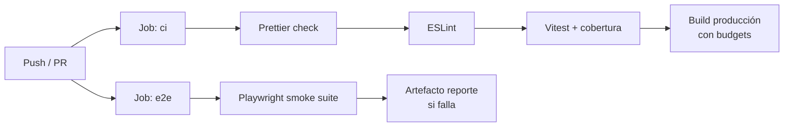

# Pipeline CI

sgivu-frontend usa **GitHub Actions** para validación automática en cada push y pull request. El pipeline está diseñado para detectar regresiones rápidamente con dos jobs paralelos.

**Ruta**: `.github/workflows/ci.yml`

## Flujo del Pipeline



Los dos jobs corren en paralelo en `ubuntu-latest`.

## Job `ci`: Calidad de Código y Build

<Steps>
  <Step title="Checkout + Setup Node">
    Configura Node.js con la versión de `.nvmrc` (v24) y hace `npm ci` para
    instalar dependencias con el lockfile exacto.
  </Step>
  <Step title="Generar archivos de entorno">
    ```bash cp src/environments/environment.example.ts
    src/environments/environment.ts cp
    src/environments/environment.development.example.ts
    src/environments/environment.development.ts ``` Los valores no son de
    producción — solo sirven para que el build compile.
  </Step>
  <Step title="Prettier check">
    ```bash npx prettier --check . ``` Falla si hay archivos mal formateados. El
    hook `pre-commit` (husky + lint-staged) debería prevenir esto, pero CI lo
    verifica como segunda capa.
  </Step>
  <Step title="ESLint">
    ```bash npm run lint ``` Reglas de `angular-eslint`: templates, signals,
    imports circulares, etc.
  </Step>
  <Step title="Vitest con cobertura">
    ```bash ng test --watch=false --coverage ``` Ejecuta todos los tests
    unitarios una sola vez y genera el informe de cobertura. Falla si los
    umbrales de `angular.json` no se alcanzan.
  </Step>
  <Step title="Build de producción">
    ```bash npm run build ``` Build completo con AOT y optimizaciones. Falla si
    algún chunk excede los presupuestos de tamaño definidos en `angular.json`
    (1.5 MB initial, 12 kB por componente style).
  </Step>
</Steps>

## Job `e2e`: Tests de Extremo a Extremo

<Steps>
  <Step title="Checkout + Setup + Install">
    `npm ci` + instalar Chromium de Playwright.
  </Step>
  <Step title="Generar entornos">Igual que en el job `ci`.</Step>
  <Step title="Ejecutar suite Playwright">
    ```bash npm run e2e ``` Levanta `ng serve`, corre los 8 specs con red
    simulada y cierra el servidor.
  </Step>
  <Step title="Artefacto en fallo">
    Si algún test falla, sube el reporte HTML de Playwright como artefacto del
    workflow para diagnóstico.
  </Step>
</Steps>

## Gates de Calidad

| Gate             | Herramienta    | Criterio                                 |
| ---------------- | -------------- | ---------------------------------------- |
| Formato          | Prettier       | 0 archivos mal formateados               |
| Linting          | angular-eslint | 0 errores                                |
| Tests unitarios  | Vitest         | 0 tests fallidos + umbrales de cobertura |
| Tamaño de bundle | Angular build  | < 1.5 MB initial, < 12 kB por style      |
| Smoke tests      | Playwright     | 0 tests fallidos                         |

## Husky y Lint-Staged (Pre-Commit)

El hook `pre-commit` de Husky ejecuta lint-staged antes de cada commit:

```json
// package.json
"lint-staged": {
  "*.{ts,html}": ["eslint --fix --no-warn-ignored"],
  "*.{ts,html,css,js,json,md}": ["prettier --write"]
}
```

Si lint-staged reformatea algún archivo, el commit falla. La solución:

```bash
git add -u    # Agregar los archivos reformateados al staging
git commit    # Reintentar el commit
```

El hook `commit-msg` valida que el mensaje siga **Conventional Commits** con commitlint.

## Próximos Pasos

<CardGroup cols={2}>
  <Card title="Tests Unitarios" icon="beaker" href="/testing/unit">
    Detalles de la configuración de Vitest
  </Card>
  <Card title="Tests E2E" icon="browser" href="/testing/e2e">
    Suite Playwright y mocks de red
  </Card>
</CardGroup>
